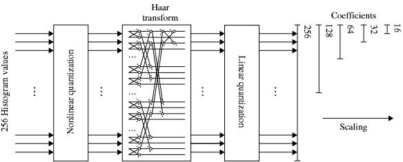
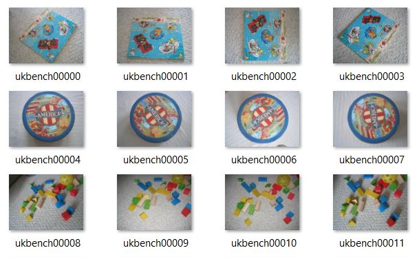
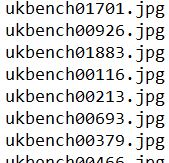
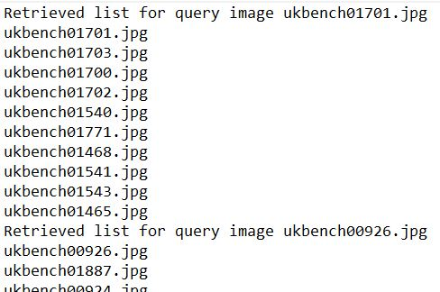
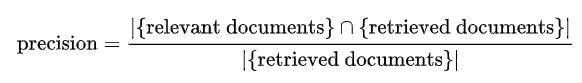
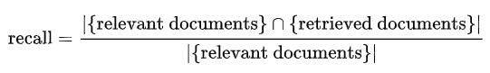
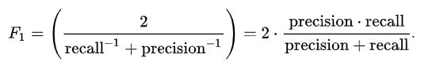
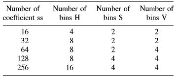
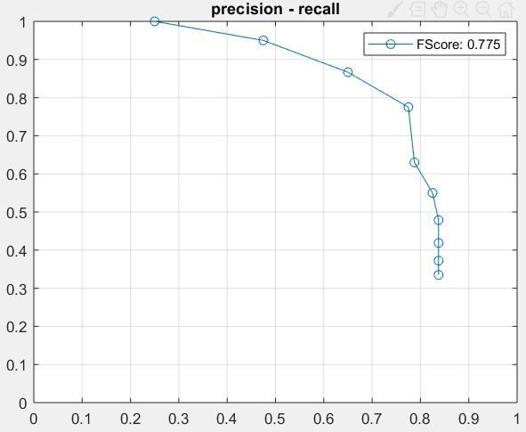

# CONTENT-BASED-IMAGE-RETRIEVAL (CBIR) with SCALABLE COLOR DESCRIPTOR (SCD)
## 1. INTRODUCTION.
The objective of this repository is to make and show a sistem that allows the recovery and identification of similar images to a query image. All of this, without using manual anotations which are expensive and slow. To do this we will use the Scalable Color Descriptor from the MPEG7 - Colors Descriptors owing to color is an important visual attribute for both human vision and computer processing. 

The Scalable Color Descriptor (SCD) can be interpreted as a Haar transform–based encoding scheme applied across values of a color histogram in the HSV color space. The histogram values are extracted, normalized and nonlinearly mapped into a four-bit integer representation, giving higher significance to small values. The Haar transform is applied to the four-bit integer values across the histogram bins. The basic unit of the transform consists of a sum operation and a difference operation which relate to primitive low-pass and high-pass filters.

  
  
In this repository we will use a database of 2000 images of the University of Kentucky which are organized in groups of 4 images. Each group has the similar image but taken with different angles and illuminations. An example:

  

So, if we have the image ukbench00000 as a query image, our perfect result will be ukbench00000, ukbench00001, ukbench00002, ukbench00003 and another 6 images.

The input file has as many rows as images we want to search. It has the following format:

  

And the output file will have the 10 best guesses for each query iamge. It has the following format:

  

The precision and recall are calculated by the mean value of each image:

  
  
  
 
 The FScore is the maximum value of the FMeasure:
 
  
  
## 2. CODE.

### 2.1. histogramHSV.m
This program calculate and save in the directory, the histogram and the non-linear quantization of the HSV color space of all the images in the database. The parameters take care of how many bins are taken for each component. In the following table of the standard MPEG7 we can look for different coefficients the equivalent pationing of the HSV color space.

      
    
### 2.2. haarTransform.m
This program calculate and save in the directory, the coefficients of the Haar Transform of the histogram of all the images. In this program the user can choose how many iterations wants to make.

### 2.3. mainProg.m
This program is the one which takes care of reading the input file, compare all the query images with all the database, find the 10 best guesses and write them in the output file and calculate and graph the precision and recall.
To compare the images we use the euclidean distance because is the one which performmed the better.

## 3. RESULTS.
Using the input.txt (random query images) given in the repository we obtain a precision-recall graph and FScore:

      

